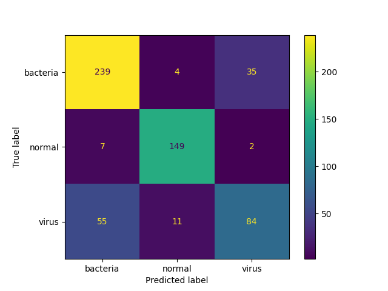
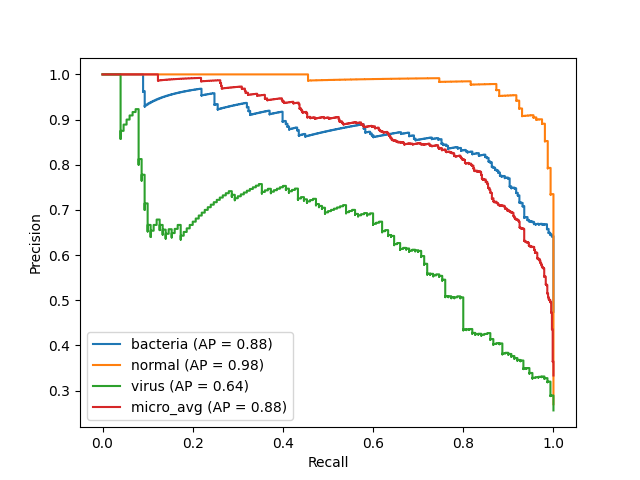
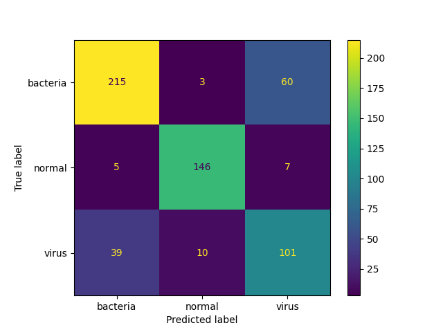

# Explainable-Neural-Networks
  
## Introduction
With the rapid advancement and increased usage of AI, it is important to understand how underlying models generate their outputs to allay fears and suspicion of unfair bias, and enable accountability which may be enforced by regulations and audits.
  
Understandability in AI can broadly be divided into the concepts of:
1. Interpretbability: Refers to intrinsic model parameters and weights that intuitively show how a model determines its generated output. This is a trait that is common in simpler models (eg. coefficients of a linear regressor).
2. Explainablity: Refers to how to take an ML model and explain the behavior in human terms. This concept often involves applying a surrogate to more complex models such as deep neural networks to unravel such blackboxes.

There are other ways to categorise "AI understandability", such as local / global, model-specific / agnostic, and their permutations. Specifically this repository explores incorporating local + model-agnostic explainability into neural networks for image classification of normal / bacterial / viral pneumonia scans.
  
The secondary objective of this repository is to develop pipelines that are interoperable with `Pytorch Lightning`, `Huggingface`, and `Captum` (explainability library). This is motivated by different pretrained model availabilities between Pytorch and Huggingface, specifically `Convnextv2` is only available in Huggingface at the time of developing this repo.
  
## Repo Structure
```
.
├── assets
│   └── images
├── conf
│   └── base
├── data
│   ├── processed
│   │   ├── predict
│   │   ├── test
│   │   │   ├── bacteria
│   │   │   ├── normal
│   │   │   └── virus
│   │   ├── train
│   │   │   ├── bacteria
│   │   │   ├── normal
│   │   │   └── virus
│   │   └── val
│   │       ├── bacteria
│   │       ├── normal
│   │       └── virus
│   └── raw
│       ├── bacteria
│       ├── normal
│       └── virus
├── docker
├── notebooks
└── src
```
  
## Setup
Clone this repository and `cd` into the working directory.
```bash
git clone git@github.com:mattoh91/Explainable-Neural-Networks.git
cd Explainable-Neural-Networks
```
  
Create the conda environment.
```bash
conda env create -f environment.yml
conda activate xnn
```

## Data
This is a dataset of chest X-ray scans to identify whether the lungs are showing normal health, bacterial pneumonia, or viral pneumonia. Of the 5,856 medical scans, 2,780 (47.5%) are bacterial, 1,583 (27.0%) are normal and (25.5%) 1,493 are viral.
  
### Loading
Curl down and unzip the data to the existing repositry using the command:
```bash
# download using
wget --load-cookies /tmp/cookies.txt "https://docs.google.com/uc?export=download&confirm=$(wget --quiet --save-cookies /tmp/cookies.txt --keep-session-cookies --no-check-certificate 'https://docs.google.com/uc?export=download&id=1VuaSBUw2MFTbobZ2ZcVjugVx-ey88xkF' -O- | sed -rn 's/.*confirm=([0-9A-Za-z_]+).*/\1\n/p')&id=1VuaSBUw2MFTbobZ2ZcVjugVx-ey88xkF" -O pneumonia.zip && rm -rf /tmp/cookies.txt

# Unzip using
unzip -q pneumonia.zip .
```
Alternatively download the dataset from [here](https://drive.google.com/file/d/1AOd7h3OWTlBTQc8Gq-gbgIBCqPDxsO6S/view?usp=share_link).
  
### Wrangling
The data source had allocated very few images to the validation folder. Wrangling was done within the `xnn.ipynb` notebook using a combination of `pandas` and `shutils` to (1) reorganise all images according to their classes in the `data/raw` folder, then (2) split them into train / val / test subfolders in the ratio of 80:10:10 in a stratified manner. 3 images - 1 from each class - were randomly taken and put into the `data/predict` folder.
  
## EDA - FiftyOne
FiftyOne is an open-source tool developed by Voxel51 which visualises image datasets and enables exploration through tagging and filters.
  
From the wrangled data, `annotations_file.csv` was generated containing all the image metadata. This `notebooks/fiftyone.ipynb` contains cells that load this metadata file into a `pandas` dataframe. This notebook is copied into the image generated by `docker/fiftyone.DockerFile`, and will be executed to spin up the FiftyOne service that references images that are bind-mounted during `docker run`.

To launch FiftyOne, please follow the following steps:
  
1. Assuming you have already cloned this Github repo and `cd` into it, build the service using docker:
```bash
docker build -f docker/fiftyone.Dockerfile \
    -t fiftyone:0.1.0 \
    --platform linux/amd64 .  
```
2. Run the service using the command:
```bash
docker run -p 5151:5151 \
    --name fiftyone \
    -v ./data:/data \
    fiftyone:0.1.0    
```
3. Access the fiftyone dashboard using the link [http://localhost:5151](http://localhost:5151) which is hosted on your local machine.
4. Stop the service using the command:
```bash
docker container stop fiftyone   

```
5. To remove the container use the command:
```bash
docker rm fiftyone   
```
  
## Training Pipeline
### Modeling Considerations
WIP  
Cross Entropy loss function + class weights, AdamW Optimizer + weight decay regularisation, dropout regularisation, early stopping callback, learning rate scheduler, model choice
  
### Feature Extraction
The training pipeline is defined within the `./src/train.py` script. Run it with the following command. `-cn` is a `hydra` option that specifies the name of the config .yaml file referenced. The config dir is hardcoded to be `./conf/base`.
  
The example config .yaml file below passes in config into `train.py` to set `requires_grad=False` all model body layers - ie. feature extraction.
```bash
python src/train.py \ 
-cn pipelines_mobilenetv2.yaml \ # hydra config.yaml file in ./conf/base/
```
  
### Fine-Tuning
The example config .yaml file below passes in config into `train.py` to set `requires_grad=True` a defined number of model body layers excluding normalisation layers - ie. fine-tuning.
```bash
python src/train.py \ 
-cn pipelines_mobilenetv2_ft.yaml \ # hydra config.yaml file in ./conf/base/
train.fine_tune.model_filepath=models/mobilenetv2_fe_200520231134.ckpt # saved model in ./models/
```
  
### Logging
`train.py` uses a Pytorch Lightning trainer with a MLFlow logger that is configured to save its logs in `./logs/mlruns`. 
  
The following hyperparameters and evaluation metrics have been hardcoded in `models.py` to be logged:  


To view the logs use the following commands:
```bash
cd logs
mlflow ui
```

### Model Saving
The best model in terms of minimum `valid_loss` will be saved in `./models` as hardcoded in the `ModelCheckpoint` callback in `train.py`. The MLFlow logger will automatically create a `./logs/mlruns/models` folder but it has a lesser priority than the model save folder configured in ModelCheckpoint.
  
## Inference + Explainability App
A Fastapi backend inference server and a simple Streamlit frontent UI have been developed and dockerised. To launch them, use the following command:
```bash
docker compose -f ./docker/docker-compose.yaml up --build
```
  
| Fastapi | Streamlit |
| --- | --- |
|  |  |
  
To use the app, drag and drop one of the images downloaded (see [Loading](#loading)) into the upload area, then press the `Predict` button. The same image should be returned with an explainability mask using Integrated Gradients where the green pixels contributed positively to the predicted class whilst the red pixels gave negative contributions.
  
## Getting Started Notebook
Refer to `Explainability` section of [notebooks/xnn.ipynb](notebooks/xnn.ipynb)

## Results
### Evaluation metrics
With an imbalanced dataset, precision and recall metrics were used in favour of accuracy and Receiver Operating Characteristic curve (ROC) as they are not inflated by True Negative counts.
  
| Precision | Recall |
| --- | --- |
|  |  |
* Precision Recall Curve (PRC): The PRC is the graphical form of precision and recall which illustrates the trade-off between minimising False Positives (FP) in precision versus minimising False Negatives (FN) in recall across different classifier probability thresholds. An ideal PRC would have an area under curve (AUC) of 1.
  
* F1-Score: The amalgamation of precision and recall
  
  

* Average precision (AP): Similar to the concept of AUC summarising the ROC curve, average precision summarises the PRC as the weighted mean of precisions at each threshold, where the weight is the increase in recall between the current and previous threshold. The value is between 0 and 1 and higher is better. In this implementation the logger was configured to log the average precision Torchmetric which is by default macro-averaged. Weighted-average was not used as I wanted each class to be treated with equal importance / weight.
  
    

### Results summary

* Best model: `Fine-tuned Mobilenet v2 with class weights` has the highest test (macro) average precision.
  
| Confusion Matrix (CM) | CM Count Plot | PRC (per class + microavg) |
| --- | --- | --- |
|  |  |  |
  
* The test CM plots show the virus class having the most FP and FN, with the errors mostly relating to `bacteria` images being wrongly classified as `virus` and vice versa.
* The point above is reiterated in the PRC which shows the `virus` PRC to have the smallest AUC and AP.
  
### Discussion:
_Simpler models perform better_    
* Earlier experiments using classifier heads with more neurons and fine-tuning with a greater number of layers with `requires_grad=True` performed more poorly. 
* Looking into the most complex model used, Convnextv2, the validation loss oscillates above and below the training loss, which is indicative that the model has not generalised well to the unseen validation dataset. Unexpectedly, the greater complexity of the model may have resulted in overfitting.

  
_Class weighting yields poorer F1_
  
| Confusion Matrix (CM) | CM Count Plot | PRC (per class + microavg) |
| --- | --- | --- |
|  |  |  |
  
* The second best model - fine-tuned Mobilenet v2 without class weights - in terms of test AP has the best F1 and valid_loss.
* Looking into its test PRC reveal a monotonically inverse relationship between precision and recall. In the best model, low levels of recall had a positive relationship with precision, that reversed at higher levels of recall.
* Comparing its test CM against the best model, it had higher `bacteria` TP, lower `virus` FP (better virus precision), and to a lesser degree higher `virus` FN (worse virus recall). This contributed to a higher F1 overall.
* The class weights applied has the intended effect of better minority class predictions, and is overall a more robust model despite contrary F1 results.

  
_SME input still required_    
Integrated Gradients helps identify which pixels the classifier uses for prediction and is a great boon for error analysis. However SME input is still required to formulate the logic for errors before corrections can be made to model components.

## CI
### Pre-commit hook
Pre-commit is a collection of hooks that are triggered upon every `git commit`. Specific to this project, these hooks are used to check and amend Python code to conform to PEP8 standards. Creating the conda environment (see [Setup](#setup)) should have already pip installed pre-commit, which references the predefined hooks in `.pre-commit-config.yaml`. To use pre-commit, simply follow the steps below:
  
1. Install the pre-commit hooks into your git repo:
    ```bash
    pre-commit install
    ```
2. Either do a `git commit` which automatically triggers the hooks, or manually run pre-commit to check specific files using the command below:
    ```bash
    pre-commit run --files ./path/to/folder/*  
    ```
  
More information on pre-commit hook [here](https://pre-commit.com/).
  
## WIP
1. Github CI pipeline

