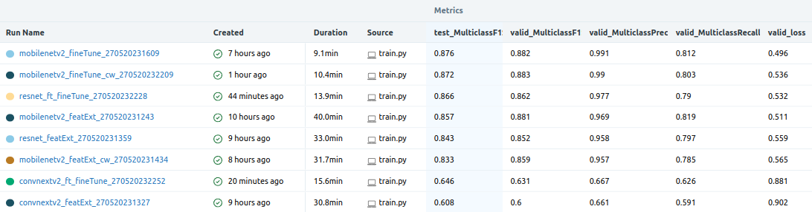
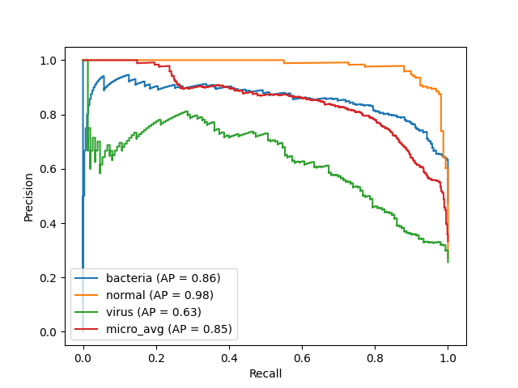

# Explainable-Neural-Networks
  
## Introduction
With the rapid advancement and increased usage of AI, it is important to understand how underlying models generate their outputs to allay fears and suspicion of unfair bias, and enable accountability which may be enforced by regulations and audits.
  
Understandability in AI can broadly be divided into the concepts of:
1. Interpretbability: Refers to intrinsic model parameters and weights that intuitively show how a model determines its generated output. This is a trait that is common in simpler models (eg. coefficients of a linear regressor).
2. Explainablity: Refers to how to take an ML model and explain the behavior in human terms. This concept often involves applying a surrogate to more complex models such as deep neural networks to unravel such blackboxes.

There are other ways to categorise "AI understandability", such as local / global, model-specific / agnostic, and their permutations. Specifically this repository explores incorporating local + model-agnostic explainability into neural networks for image classification of normal / bacterial / viral pneumonia scans.
  
The secondary objective of this repository is to develop pipelines that are interoperable with `Pytorch Lightning`, `Huggingface`, and `Captum` (explainability library). This is motivated by different pretrained model availabilities between Pytorch and Huggingface, specifically `Convnextv2` is only available in Huggingface at the time of developing this repo.
  
## Repo Structure
```
.
├── assets
│   └── images
├── conf
│   └── base
├── data
│   ├── processed
│   │   ├── predict
│   │   ├── test
│   │   │   ├── bacteria
│   │   │   ├── normal
│   │   │   └── virus
│   │   ├── train
│   │   │   ├── bacteria
│   │   │   ├── normal
│   │   │   └── virus
│   │   └── val
│   │       ├── bacteria
│   │       ├── normal
│   │       └── virus
│   └── raw
│       ├── bacteria
│       ├── normal
│       └── virus
├── docker
├── notebooks
└── src
```
  
## Setup
Clone this repository and `cd` into the working directory.
```bash
git clone git@github.com:mattoh91/Explainable-Neural-Networks.git
cd Explainable-Neural-Networks
```
  
Create the conda environment.
```bash
conda env create -f environment.yml
conda activate xnn
```

## Data
This is a dataset of chest X-ray scans to identify whether the lungs are showing normal health, bacterial pneumonia, or viral pneumonia. Of the 5,856 medical scans, 2,780 (47.5%) are bacterial, 1,583 (27.0%) are normal and (25.5%) 1,493 are viral.
  
### Loading
Curl down and unzip the data to the existing repositry using the command:
```bash
# Download using
wget --load-cookies /tmp/cookies.txt "https://docs.google.com/uc?export=download&confirm=$(wget --quiet --save-cookies /tmp/cookies.txt --keep-session-cookies --no-check-certificate 'https://docs.google.com/uc?export=download&id=1VuaSBUw2MFTbobZ2ZcVjugVx-ey88xkF' -O- | sed -rn 's/.*confirm=([0-9A-Za-z_]+).*/\1\n/p')&id=1VuaSBUw2MFTbobZ2ZcVjugVx-ey88xkF" -O pneumonia.zip && rm -rf /tmp/cookies.txt

# Unzip using
unzip -q pneumonia.zip .
```
Alternatively download the dataset from [here](https://drive.google.com/file/d/1AOd7h3OWTlBTQc8Gq-gbgIBCqPDxsO6S/view?usp=share_link).
  
### Wrangling
The data source had allocated very few images to the validation folder. Wrangling was done within the `xnn.ipynb` notebook using a combination of `pandas` and `shutils` to (1) reorganise all images according to their classes in the `data/raw` folder, then (2) split them into train / val / test subfolders in the ratio of 80:10:10 in a stratified manner. 3 images - 1 from each class - were randomly taken and put into the `data/predict` folder.
  
## EDA - FiftyOne
FiftyOne is an open-source tool developed by Voxel51 which visualises image datasets and enables exploration through tagging and filters.
  
From the wrangled data, `annotations_file.csv` was generated containing all the image metadata. This `notebooks/fiftyone.ipynb` contains cells that load this metadata file into a `pandas` dataframe. This notebook is copied into the image generated by `docker/fiftyone.DockerFile`, and will be executed to spin up the FiftyOne service that references images that are bind-mounted during `docker run`.

To launch FiftyOne, please follow the following steps:
  
1. Assuming you have already cloned this Github repo and `cd` into it, build the service using docker:
```bash
docker build -f docker/fiftyone.Dockerfile \
    -t fiftyone:0.1.0 \
    --platform linux/amd64 .  
```
2. Run the service using the command:
```bash
docker run -p 5151:5151 \
    --name fiftyone \
    -v ./data:/data \
    fiftyone:0.1.0    
```
3. Access the fiftyone dashboard using the link [http://localhost:5151](http://localhost:5151) which is hosted on your local machine.
4. Stop the service using the command:
```bash
docker container stop fiftyone   

```
5. To remove the container use the command:
```bash
docker rm fiftyone   
```
  
## Training Pipeline
### Modeling Considerations
* _Model choice_: A variety of increasingly complex image classifiers were used. The motivation behind this is to use the vanilla Mobilenetv2 (2.2M params) and Resnet as benchmarks for the more exotic Convnextv2 (27.9M params). For more in-depth information on each model, please refer to the [Appendix](#appendix) section.
* _Loss function_: Cross entropy was used for this multiclassification problem. In addition, the `weight` argument is hyperparameterised via hydra to enable experiment runs with / without class weighting to account for class imbalance. This is discussed further in the [Results](#results) section.
* _Regularisation_:
    * _AdamW Optimiser_: AdamW was used in favour of Adam as it applies the weight decay hyperparameter after loss computation during the update step, which prevents the regularisation term from being included into the exponential moving average (EMA) gradient and the EMA squared gradient components, which would reduce the regularisation effect.
    * _Dropout layers_: Dropout layers were used to introduce noise into the training process. Randomly dropping neurons prevents co-adaptation where one neuron compensates for the inaccuracy in a preceding neuron, enabling more robust gradient updates during backprop and a more robust model.
    * _Early stopping_: Early stopping is implemented to stop training should validation loss be found to not be decreasing for 3 successive epochs, thus preventing overfitting on the training dataset.
    * _Data augmentation_: Applying various transforms to input images increases the variance in your dataset without sourcing for new data, which improves the ability for the model to generalise to unseen data. Specifically, images were grayscaled, random-resized-cropped, and normalised to a 224x224 image.
* _Learning rate scheduler_: A learning rate scheduler was used to decrease the learning rate if validation loss plateaus for 2 consecutive epochs. This prevents the gradient update from becoming too large, which would prevent the loss function from converging to its minima.
  
### Feature Extraction
The training pipeline is defined within the `./src/train.py` script. Run it with the following command. `-cn` is a `hydra` option that specifies the name of the config .yaml file referenced. The config dir is hardcoded to be `./conf/base`.
  
The example config .yaml file below passes in config into `train.py` to set `requires_grad=False` all model body layers - ie. feature extraction.
```bash
python src/train.py \ 
-cn pipelines_mobilenetv2.yaml \ # hydra config.yaml file in ./conf/base/
```
  
### Fine-Tuning
The example config .yaml file below passes in config into `train.py` to set `requires_grad=True` a defined number of model body layers excluding normalisation layers - ie. fine-tuning.
```bash
python src/train.py \ 
-cn pipelines_mobilenetv2_ft.yaml \ # hydra config.yaml file in ./conf/base/
train.fine_tune.model_filepath=models/mobilenetv2_fe_200520231134.ckpt # saved model in ./models/
```
  
### Logging
`train.py` uses a Pytorch Lightning trainer with a MLFlow logger that is configured to save its logs in `./logs/mlruns`. 
  
The following hyperparameters and evaluation metrics have been hardcoded in `models.py` to be logged:  


To view the logs use the following commands:
```bash
cd logs
mlflow ui
```

### Model Saving
The best model in terms of maximum `valid_MulticlassF1Score` will be saved in `./models` as hardcoded in the `ModelCheckpoint` callback in `train.py`. The MLFlow logger will automatically create a `./logs/mlruns/models` folder but it has a lesser priority than the model save folder configured in ModelCheckpoint.
  
## Inference + Explainability App
### Default Settings
A Fastapi backend inference server and a simple Streamlit frontent UI have been developed and dockerised. To launch them, use the following command:
```bash
docker compose -f ./docker/docker-compose.yaml up --build
```
  
| Fastapi | Streamlit |
| --- | --- |
|  |  |
  
To use the app, drag and drop one of the images downloaded (see [Loading](#loading)) into the upload area, then press the `Predict` button. The same image should be returned with an explainability mask using Integrated Gradients where the green pixels contributed positively to the predicted class whilst the red pixels gave negative contributions.
  
### Custom Model
The default Fastapi image comes preloaded with a fine-tuned Mobilenetv2 model. Should you want to train and use your own model with the app, save your `.ckpt` model file in the `models/` folder, then change the highlighted sections in the `docker/docker-compose.yaml` file below:
  

  
The volume will bind your local `model/` directory to the Docker container, whilst the `MODEL_FILENAME` environment variable will be passed into the Fastapi container, where it will be used for model loading.
  
## Getting Started Notebook
Refer to `Explainability` section of [notebooks/xnn.ipynb](notebooks/xnn.ipynb)

## Results
### Evaluation metrics
With an imbalanced dataset, precision and recall metrics were used in favour of accuracy and Receiver Operating Characteristic curve (ROC) as they are not inflated by True Negative counts. Where applicable, these metrics were configured with `average="weighted"` as an argument to account for class imbalance.
  
| Precision | Recall |
| --- | --- |
|  |  |
* Precision Recall Curve (PRC): The PRC is the graphical form of precision and recall which illustrates the trade-off between minimising False Positives (FP) in precision versus minimising False Negatives (FN) in recall across different classifier probability thresholds. An ideal PRC would have an area under curve (AUC) of 1.
  
* F1-Score: The amalgamation of precision and recall
  
  

* Average precision (AP): Similar to the concept of AUC summarising the ROC curve and also known as AUC-PRC, average precision summarises the PRC as the weighted mean of precisions at each threshold, where the weight is the increase in recall between the current and previous threshold. The value is between 0 and 1 and higher is better.
  
    

### Results summary

* Best model: `Fine-tuned Mobilenet v2 without class weights` has the highest test F1 and lowest validation loss.
  
| Confusion Matrix (CM) | CM Count Plot | PRC (per class + microavg) |
| --- | --- | --- |
|  |  |  |
  
* The test CM plots show the virus class having the most FP and FN, with the errors mostly relating to `bacteria` images being wrongly classified as `virus` and vice versa.
* The point above is reiterated in the PRC which shows the `virus` PRC to have the smallest AP / AUC-PRC.
  
### Discussion:
_Simpler models perform better_    
* Earlier experiments using classifier heads with more neurons and fine-tuning with a greater number of layers with `requires_grad=True` performed more poorly. 
* Looking into the most complex model used, Convnextv2, the validation loss plateaus at a much higher value compared to the simpler models.
  
_Class weighting yields poorer F1_
  
| Confusion Matrix (CM) | CM Count Plot | PRC (per class + microavg) |
| --- | --- | --- |
|  |  |  |
  
* Class weights were applied to the loss function during fine-tuning of the best-performing model to create a fine-tuned Mobilenet v2 with class weights model.
* Unexpectedly this model registered a lower F1 than its non-class-weighted counterpart.
* Looking at the per-class and microaveraged PRCs for the class-weighted Mobilenet v2 and its non-class-weighted counterpart, the latter shows marginally better AP (AUC-PRC). To investigate further, we look to the other 2 plots which have the counts of TP, TN, FP, FN.
* Comparing the test CMs and count plots of the class-weighted Mobilenet v2 against its non-class-weighted counterpart, the former had higher `bacteria` FN and (worse bacteria recall) `virus` FP (worse virus precision), and to a lesser degree fewer `virus` FN (better virus recall) and `bacteria` FP (better bacteria precision). This contributed to a lower F1 overall.
* The class weights applied has the intended effect of better minority class recall at the expense of minority class precision and majority class recall.

  
_SME input still required_    
Integrated Gradients helps identify which pixels the classifier uses for prediction and is a great boon for error analysis. However SME input is still required to formulate the logic for errors before corrections can be made to model components.

## CI
### Pre-commit hook
Pre-commit is a collection of hooks that are triggered upon every `git commit`. Specific to this project, these hooks are used to check and amend Python code to conform to PEP8 standards. Creating the conda environment (see [Setup](#setup)) should have already pip installed pre-commit, which references the predefined hooks in `.pre-commit-config.yaml`. To use pre-commit, simply follow the steps below:
  
1. Install the pre-commit hooks into your git repo:
    ```bash
    pre-commit install
    ```
2. Either do a `git commit` which automatically triggers the hooks, or manually run pre-commit to check specific files using the command below:
    ```bash
    pre-commit run --files ./path/to/folder/*  
    ```
  
More information on pre-commit hook [here](https://pre-commit.com/).
  
## Future Works
1. Github CI pipeline
2. LoRA for efficient fine-tuning
  
## Appendix
  
### Integrated Gradients (IG)
* Motivations:
    * Formulate an axiomatic approach to evaluate deep learning (DL) attribution methods:
        1. Sensitivity: (a) For every input and baseline (an input that is absent of any feature which serves as a basis for comparison) that differ in one feature but have different predictions, then the differing feature should be given a non-zero attribution. (b) If the function implemented by the deep network does not depend (mathematically) on some variable, then the attribution to that variable is always zero.
        2. Implementation invariance: Two networks are functionally equivalent if their outputs are equal for all inputs, despite having very different implementations.
    * Devise a new attribution method (IG) that champions these 2 axioms since most methods at the time of writing fall short of 1 axiom or the other.
* Mechanics:
    * In the case of image classifiers, early attribution models use high gradient values to tell which pixels / features have the most value / influence in the hypothesis function which transforms inputs into outputs (think high-valued `m` in `Y = mX + C`).
    * However, gradients only describe `local` (to point in training) changes in your model's hypothesis function wrt pixel values.
    * As the model learns pixel-prediction relationships, the gradients for these "learned" pixels saturate towards 0 - thus violating the Sensitivity axiom.
    
    * Proposed IG algorithm:
        1. Linear interpolation of small steps from a baseline `x'` with 0 value to an input feature `x` with a value of 1.
        2. Compute gradients at each step.
        3. Accumulate gradients using integration - the continuous analog for summation - then take an average for attribution scoring.
* Mathematics:
    * Original formula:
    
    * More computationally efficient implementation which uses trapezoidal [Riemann Sums](https://en.wikipedia.org/wiki/Riemann_sum) to approximate the definite integral:
    
  
* Paper: [Axiomatic Attribution for Deep Networks (Sundararajan et al., 2017)](https://arxiv.org/abs/1703.01365)
* Other references:
    * Tensorflow [tutorial](https://www.tensorflow.org/tutorials/interpretability/integrated_gradients)
    * Stanford Online CS224U Natural Language Understanding [lecture](https://www.youtube.com/watch?v=RFE6xdfJvag)

### Resnet
* Motivation: Resnet was created to overcome the phenomenon known as the degradation problem in deeper neural networks. This occurs as layers are added to a network until it passes a point of accuracy saturation and starts to experience both test and training error increase. This is distinct from overfitting as training error is increasing.
* Mechanics:
    * The underlying notion is that adding more layers to a shallow network should at minimum achieve the same accuracy as the original shallow network.
    * Mathematically speaking, the same accuracy can be achieved if every additional layer learns to output the identity function where X is the output of the preceding layer:  
    
    * Evidenced by the degradation problem, the identity function is not easily learnt through multiple non-linear functions / layers.
    * Residual functions were proposed as an alternative and are applied as skip connections in residual blocks.  
    
    * Given input `x`, a desired mapping / output `y`, additional layers in between can be treated as a residual `F(x) = y - x`. The model will ultimately still be learning to map `x` to `y` in the form of `y = F(x) + x`.
    * This would enable the model to learn the identity function by setting the weights of the residual `F(x)` to 0, which is more easily learnt than the identity function without the residual in the equation.
    * The authors proposed using 2-3 layers per block as a single layer would give a linear layer `y = Wx + x` where `F(x) = Wx`, which defeats the purpose of using a neural network to learn non-linear solutions. Two layers within a block would give a non-linear residual and introduce non-linearity to the output. The two-layer residual is shown below, where `σ`is a RELU function.  
    
    * The skip connection is placed behind a RELU as putting it after would result in a RELU activated residual with values constrained between 0 and 1. Ideally the residual should not be constrained so that it can be trained into any function which may output values outside 0 to 1.
    * For deeper networks the authors suggest a bottleneck residual block, where 1x1 conv2d kernels are first used to reduce the input to a shallower depth, and then expand the intermediate output to a deeper depth. Overall this uses less trained parameters:  
    
* Architecture:  

* Paper: [Deep Residual Learning for Image Recognition (He, et al., 2015)](https://arxiv.org/abs/1512.03385)
* Other references:
    * Intuition Behind Resnet [article](https://towardsdatascience.com/intuition-behind-residual-neural-networks-fa5d2996b2c7) (Rajagopal, 2020)
  
### Mobilenet v2 - WIP
* Motivation: Efficient convnets for mobile and embedded vision applications.
* Mechanics: 
    * Mobilenet v1 introduced depthwise separable convolutions. As explained in [Paperswithcode](https://paperswithcode.com/method/depthwise-separable-convolution#:~:text=While%20standard%20convolution%20performs%20the,a%20linear%20combination%20of%20the), it is a deconstructed version of a standard convolution operation which splits the channel-wise (depth) and spatial-wise (height and width) into 2 steps - Depthwise and Pointwise convolutions:
    * Depthwise convolution: This operation is used for spatial-wise computation (confusing naming convention - each channel comprises height and width with depth of 1). It involves the application of 1 kernel to each channel separately then apply a stacking operation to put each channel output back together again:

        | Standard Conv | Depthwise Conv |
        | --- | --- |
        |  |  |
  
    * Pointwise convolution: This operation is used for depth-wise computation. Uses a 1x1 convolution to linearly combine the stacked output from the Depthwise convolution across the channels.
        
    * Putting them together: Depthwise convolution has a receptive field of the kernel's height x width spatially but 1 features / channel-wise. Pointwise convolution complements this as it has a receptive field of 1 pixel spatially but encompasses all features / channel-wise. The image below shows a standard conv (background) versus a depthwise separable conv (foreground):
        
    * Mobilenet v1 also introduced 2 hyperparameters:
        * Width multiplier: For a given layer M and width multiplier α, the number of input channels M becomes αM and the number of output channels N becomes αN. This hyperparameter can be used to thin a network uniformly at each layer.
        * Resolution multiplier: This multiplier ρ is applied to the input image and the internal representation of every layer is subsequently reduced by the same multiplier. ρ ∈ (0, 1] which is typically set implicitly so that the input resolution of the network is 224, 192, 160 or 128. In practice we implicitly set ρ by setting the input resolution.
    * Mobilenet v2 introduced the concept of inverted residual blocks and linear bottlenecks.
    * The linear bottleneck is the next innovative step that comes after the usage of the width multiplier hyperparameter from Mobilenet v1 to reduce the dimensionality of a layer whilst preventing non-linear activations from destroying too much information (eg. ReLU loses all information on values <0). This follows the 2 ideas:
        1. The `Bottleneck` (ie. narrow layer) idea: For a layer L with an activation tensor of h x w pixels and d dimensions, the set of activation outputs forms a "manifold of interest" that could be embedded within a lower-dimensional subspace of the input space.
        2. The `Linear` idea: Given that ReLU is the `max(0, F(x))` where `F(x)` is some linear function - this is a general statement that does not considering successive ReLU activations that are inputs into other ReLUs) - a non-zero volume (3d tensor) output corresponds to a linear transformation. 
    * Inverted residual blocks are inspired by the intuition that the bottlenecks contain all the necessary information, while an
    expansion layer acts merely as an implementation detail (to get a desired depth?) that accompanies a non-linear transformation of the tensor, we use shortcuts directly between the bottlenecks.
    
        | Standard Residual Block | Inverted Residual Block |
        | --- | --- |
        |  |  |

        * Standard residual blocks from the original Resnet paper had residual blocks in a wide -> narrow -> wide configuration, with its skip connection from one wide layer to the other. Inverted residual blocks have residual blocks in a narrow -> wide -> narrow configuration with skip connections from one narrow layer to the other.
        * Within the inverted residual block, depthwise separable convolutions from Mobilenet v1 is applied.
    * Additional implementation details:
        * ReLU6 is used as the activation function, which is ReLU upper bounded to 6. No idea why 6 except that this number gives good results.
        * Mobilenet V2 consists blocks that either have stride of 1 or 2. The former refers to inverted residual blocks whilst the latter has no skip connection as the stride of 2 makes the dimensions between the input and output to be incompatible for the addition operation needed for the skip connection.
    * Overall these ideas significantly reduce the number of parameters and multiplication operations in the network.

* Architecture:  
    
* Papers:
    * [MobileNets: Efficient Convolutional Neural Networks for Mobile Vision Applications (Howard, et al., 2017)](https://arxiv.org/abs/1704.04861)
    * [Mobilenet v2: Inverted Residuals and Linear Bottlenecks (Sandler, et al., 2018)](https://arxiv.org/abs/1801.04381)
* Other references:
    * Groups, Depthwise, and Depthwise-Separable Convolution [video](https://www.youtube.com/watch?v=vVaRhZXovbw) (Animated AI, 2023)
    * Depthwise Separable Convolutions [video](https://www.youtube.com/watch?v=T7o3xvJLuHk) (CodeEmporium, 2018)
    * Using Depthwise Separable Convolutions [article](https://machinelearningmastery.com/using-depthwise-separable-convolutions-in-tensorflow/) (Chng, 2022) 
    * A Basic Introduction to Separable Convolutions [article](https://towardsdatascience.com/a-basic-introduction-to-separable-convolutions-b99ec3102728) (Wang, 2018)
    * Mobilenetv2 applied DL lecture [video](https://www.youtube.com/watch?v=hzj9kEU8QdA) (Raissi, 2021)
    * Inverted Residuals and Linear Bottlenecks [article](https://towardsdatascience.com/mobilenetv2-inverted-residuals-and-linear-bottlenecks-8a4362f4ffd5) (Pröve, 2018)
  
### Convnextv2 - WIP
* Motivation: Enhancing convnets to achieve comparable performances against vision transformers (ViT).
* Mechanics: v2 -> Global response normalisation
* Architecture:
* Papers:
    * Convnext
    * Convnext v2
* Other references: